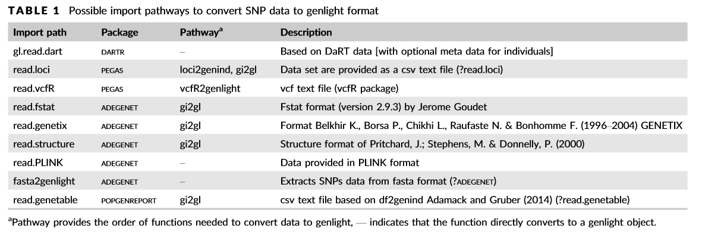

```{r setup, include=FALSE, }
knitr::opts_chunk$set(echo = TRUE)
knitr::opts_chunk$set(tidy = TRUE)
library(tufte)
library(knitr)
library(TeachBayes)
#knitr::opts_chunk$set(prompt = TRUE)
```

\newpage

#Foreword

What it this tutorial about?

In this workshop we provide an overview on the use of a recently developed R-package (dartR) that aims to integrate as many as possible ways to analyse SNP data sets. 
^[A general overview on the package (though quite a few new function have been added can be found here: [Gruber et al. 2018: https://onlinelibrary.wiley.com/doi/full/ 10.1111/1755-0998.12745](https://onlinelibrary.wiley.com/doi/full/10.1111/1755-0998.12745)].

This tutorial is meant to be run on your own pace, but obviously we encourage discussion while you type (copy/paste) the code. You can run the tutorial with the example data provided or simply adapt it to your own data. 

We will cover the following topics:


#Overview 
**Tuesday **


1. Preparing data sets 

1.1 Loading data sets into R (DArT format)

1.2 How to load other formats

  
2. The genlight object 

2.1 Explore a genlight object

2.2 quality filter your data 

2.3 subset/recode your data set


3. Visualisation 

3.1. PCoA

3.2. Genomic relatedness matrix

3.3. Mapping your data (you need coordinates)
    
    
**Wednesday**
    
4. Population genetics 

4.1. Heterozygosity

4.2. HWE

4.3. Private and fixed alleles
  
5. Landscape genetics 

5.1 Isolation by distance

5.2 Landscape resistance


6. Export data set to other formats/packages 

6.1 saving a genlight object

6.2 FASTA

6.3 STRUCTURE, fastSTRUCTURE, NewHybrid


\newpage

##0. Installing dartR

Please refer to the manual or the github page in case you have not yet installed the package dartR on your computer.
https://github.com/green-striped-gecko/dartR


**Please note: For this workshop you need to install the github version (which has some additional functions) to be able to run all code examples.**

The code to do so is:

```{r, eval=FALSE}
install.packages("devtools")
library(devtools)
install.packages("BiocManager")
BiocManager::install(c("SNPRelate", "qvalue"))
install_github("green-striped-gecko/dartR")
```


Once installed the command below should run without error: (warnings are most often okay). Be aware we noticed that you cannot use an R version of <3.2 on Macs if you want to 

```{r, message=FALSE, warning=FALSE}
library(dartR)
```

You should have version 1.1.4 installed.

```{r}
packageVersion("dartR")
```

#1. Preparing data sets 

## 1.1. Loading data sets into R (DArT format)

Diversity Arrays Technology Pty Ltd (DArT™) supplies your data as excel spreadsheets in comma delimited format (.csv). Several files are provided.

*	**SNP_1row.csv**	contains the SNP genotypes in one row format
*	**SNP_2row.csv**	contains the SNP genotypes in two row format
*	**SilicoDArT.csv**	contains the presence(1)/absence(0) of the sequence tag at a locus for each individual (analogous to AFLPs)
*	**metadata.csv**	contains a report of the success of the sequencing and an explanation of the locus metadata provided in the above spreadsheets.

\newpage

## Reading DArT Files into a Genlight Object

SNP data can be read into a genlight object using gl.read.dart(). This function intelligently interrogates the input csv file to determine
*	if the file is a 1-row or 2-row format, as supplied by Diversity Arrays Technology Pty Ltd.
*	the number of locus metadata columns to be input (the first typically being AlleleID and the last repAvg).
*	the number of lines to skip at the top of the csv file before reading the specimen IDs and then the SNP data themselves.
*	if there are any errors in the data.


For a test we use the inbuild files. They are stored in your package under:

```{r}
fp <- file.path(system.file(package = "dartR"), "extdata")
fp 
dir(fp)

```


```{block, type="task"}

1. Explore the file: **testset_SNPs_2Row.csv** by opening it into Excel, Calc (or similar).

2. How many loci and how many samples are stored there?

3. Is there sequence information stored? Under which header (the default should be TrimmedSequence)?

```

You can load the data and convert it into a genlight object (the format supported by all dartR functions) via the following code:

```{r}
#create the path to the file
fn <-  file.path(fp, "testset_SNPs_2Row.csv")
#read the data and store it in object gl
gl <- gl.read.dart(filename = fn, probar = F)

```

Now all the data from this file is stored into a genlight object ^[for a detailed description of this format please refer to the workshop manual.]. In brief the genlight format allows to store large data sets very efficiently (compacted) and at the same time allows to interrogate the data set very conviniently via accessors. 

We can inspect if the has been read correctly by typing the name of the object: ```gl```.

```{r}
gl
```

A bit of R background. This ```gl``` object is a so called S4 object, which is R's attempt to implement object oriented programming. The main message is that you need to use the '@' sign to access its slots (sub-components) [if no accessor function exists].

To report the number of loci, individuals and number of populations we can use:

```{r}
#number of loci
nLoc(gl)  
#or you could use
length(gl@loc.names)

#number of individuals
nInd(gl)

```


Let's have a look at the other slots:
```{r}
gl
```


```{block, type="task"}
There are more slots in the genlight object (type gl) For some accessors exist and for some don't. For example:
position(), indNames(), locNames(), ploidy() are accessors, but there are none for 
```\@loc.all, \@other, \@gen```.

Inspect all the content in those slots to get an overview on the data set. Here it might be helpful to employ functions such as 
```summary(), table()``` 
or to visualise 
```barplot(), hist()```.

```


You might wonder where is the SNP data actually stored and have explored the \@gen slot, which contains that information, but still in a not easy accessible format (class SNPbin). To support here a a very important additional function for genlight objects is the as.matrix() function. It converts the SNP information in a matrix of individuals/samples across the rows and loci across the columns. The entries are either 0, 1, 2 or NA and represent the frequency of the second allele for that individual at that loci.^[Please refer to the workbook for a detailed description of this matrix]. 

The matrix has dimensions of nInd x nLoc (```r nInd(gl)``` x ```r nLoc(gl)``` in out test data set).


```{r}
#Dimensions of the matrix ind x loc
dim(as.matrix(gl))

#showing the first five individuals and the first 3 loci
as.matrix(gl[1:10, 1:3])

```


## Explore loci metrics

If you inspected the provided file or your own data you noticed that dart provides additional data on the quality and contenct of loci. Those metrics can be used to filter loci by quality (CallRate) or information content (minor allele frequence). The information is also stored in the genlight object under the slot ```\@other$loc.metrics```. 

```\@other$loc.metrics``` is a data.frame (a table in R), that has a **row** for each SNP loci. You can explore those entries via:
^[A complete overview of each of the loci metrics is provided in the manual.]

```{r, fig.height=3}
#names of loc.metrics
names(gl@other$loc.metrics)

hist(gl@other$loc.metrics$CallRate)
hist(gl@other$loc.metrics$RepAvg)


```


## Add ind.metrics

As you might noticed there is no information on the individual provided in the initional file on the loci. For example there is the accessor ```nPop()``` which returns the number of populations in your data set.

```{r}
nPop(gl)
```

As none was provided yet we need to learn how to do so.
This information has to be provided with a second file that has as the most important column the id of the individuals that needs to match those in the SNP file you received from dart.
As an example there is a data set provided within the dartR package **testset_metadata.csv**:

```{r}
fp
dir(fp)
```


```{block, type="task"}

Inspect the file **testset_metadata.csv** by opening it into Excel, Calc or similar.

1. How many rows do you expect to be there?

2. Note and remember the header names (spelling) of the first four columns.
```

There are four important header identifier that have a special function:

header      |     meaning               
-------|----------------------------------------------------------------
 id | matching id to link information of loci and individuals [compulsory]. **Samples that could not be matched are dropped!!!**
 pop  | information on population assignment of individuals (used by many function as the default hierachy) [optional]
 lat  | latitude of a sample in geographic coordinates (WGS84, GDA94) [optional]
 lon  | longitude atitude of a sample in geographic coordinates (WGS84, GDA94) [optional] 
 other| can be provided and are copied but are not used in other functions (except sex, by ```gl.sexlinkage```).


We can load and combine the information of both files into a single genlight object using the ```gl.read.dart()``` function.

```{r}
# filename of the Dart SNP file
fn <-  file.path(fp, "testset_SNPs_2Row.csv")
# filename of the file on individuals/samples
ifn <- file.path(fp, "testset_metadata.csv")

gl <- gl.read.dart(filename = fn, ind.metafile = ifn, probar = F)

```

```{block, type="task"}

Go through the output in the console. It provides important information if the data have been combined correctly.

1. Were all id's of the samples matched?
2. Find the slot where a copy of the information on individuals is stored?
3. Explore the \@pop slot (accessors ```nPop(), pop()```)
4. Create a table on the number of individuals per population to find out how many individuals per population were sampled.
5. What is the sex ratio of the sampled individuals?

6. Explore the data set ```foxes.gl``` by just type
foxes.gl into the console.

```


Now we have a "complete" genlight object with data on loci and individuals stored in it. Feel free to explore the example data set  or try to import your own data and explore it.


You have finished the first part of the tutorial. To relax try the command below (it uses the lat lon information of the samples in the \@other$latlong slot):

```{r}
gl.map.interactive(gl)
```


## 1.2 How to load other formats

There are many ways to load data sets of other types into R. The main aim you want to achieve, is to resemble the structure of the genlight object as closely as possible, as it allows you to work with dartR and use most of the functions.

The idea is "simple", we first create a genlight object that stores the SNP data and then we add the relevant loci and individual metrics to the required slots.

Below is a table from the publication of the package:[Gruber et al. 2018: https://onlinelibrary.wiley.com/doi/full/ 10.1111/1755-0998.12745](https://onlinelibrary.wiley.com/doi/full/10.1111/1755-0998.12745)].

```{r, out.width="110%", fig.align='left', fig.cap='', fig.fullwidth=TRUE, echo=FALSE}

```

You can see there are some options available and most of the use the gi2gl function, hence we will follow this idea and use the read.genetable version.

Again there is an example data set provided in the package, called platy.csv in the package folder.

```{r}
fp
dir(fp)


```


```{block, type="task"}
Explore the file platy.csv using Excel, Calc etc.
```

The data set is a "mockup" data set of 13 samples of platypus in Tasmania and the SNPs are provided in the format A/A (meaning at this loci the individual was homozygot for A). The data set stores also information on populations, lat long and some additional information on sex (called group) and age. 

To load this data set we will use the function read.genetable from package PopGenReport (an excellent package if you wanted to study Microsatellites ;-) or only a few SNPs).

The function has some arguments that are explained in detail via its help pages ?read.gene.table. There you can specify the columns where the ids of individuals are, the pop, lat, long column and also how the locis are coded (in one or two colums, what kind of seperator between loci and how missing values are coded.)

```{r, message=FALSE, warning=FALSE}
#load the package 
library(PopGenReport)
```


```{r}
#create a genind object
platyfile <- file.path(fp, "platy.csv")
platy.gi <- read.genetable(platyfile, ind = 1, pop=2, lat = 3, long=4, other.min = 5, other.max = 6, oneColPerAll = FALSE, sep = "/")
```

You could explore the platy.gi object, but we want to have a genlight object hence we need to convert it using ```gi2gl()```.

```{r, message=FALSE}
platy.gl <- gi2gl(platy.gi)
platy.gl
```

```{block, type="task"}

You can now explore the data set ```platy.gl```. As you can see some of the slots are filled in (e.g. ```pop(), indNAmes()```), but most are empty. 

```

There is no slot called \@loc.metrics or \@ind.metrics, which are necessary for some functions. 
For example we have information of the individuals in the slot \@other$data. 

We can simply copy those slots in the right position via:

```{r}
platy.gl@other$ind.metrics <- platy.gl@other$data
```

As you may remember, we do have quite some meta data on loci and we can create those via:

```{r}
platy.gl <- gl.recalc.metrics(platy.gl)
```

We now have a almost complete genlight object, hence we can use most of the functions from dartR. (see next section)


For example we can list the object as usual and also plot the individual over loci matrix.

```{r}
platy.gl
```

```{r}
gl.plot(platy.gl)
```


We do not have sequence information (and SNP position), hence the slot platy.gl@other$loc.metrics$TrimmedSequence is empty so we obviously cannot create a fasta file from this object. In case you have this information, then simply add the TrimmedSequence and snp position information via:

```{r, eval=FALSE}
platy.gl@other$loc.metrics$TrimmedSequence <- character.vector of sequences

position(platy.gl)<- numeric vector of SNP positions (starting at zero)

```


```{block, type="task"}

**Advanced**: 

6. Find the individual with the most missing data (loci=NA) [Hint ```as.matrix, rowSums, is.na```]

7. Plot 
```

######################################


  
#2. The genlight object 


##2.1 Explore a genlight object


A nice way to get an overview on the object (=whole matrix) is to use:

```{r}
plot(gl)
#or 
#gl.plot(gl) # if not too many individuals
```


2.2 quality filter your data 

2.3 subset/recode your data set


3. Visualisation 

3.1. PCoA

3.2. Genomic relatedness matrix

3.3. Mapping your data (you need coordinates)
