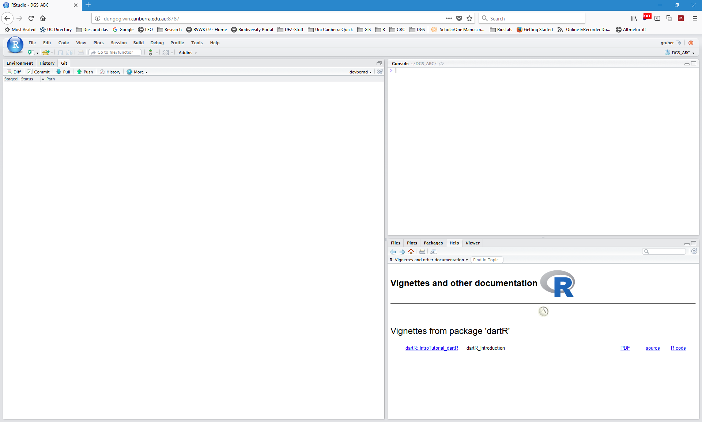
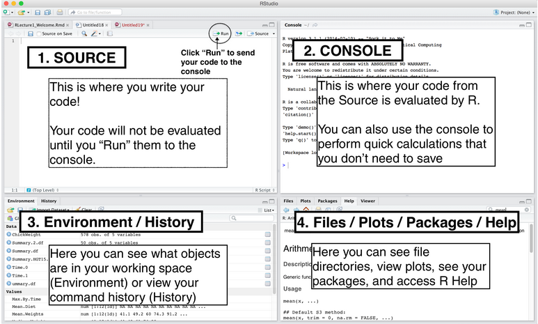

```{r setup, include=FALSE}
knitr::opts_chunk$set(echo = TRUE)
knitr::opts_chunk$set(tidy = TRUE)
library(tufte)
library(knitr)
library(TeachBayes)
#knitr::opts_chunk$set(prompt = TRUE)
```


#Foreword

What it the workshop about?

In this workshop we provide an overview on the use of a recently developed R-package (dartR) that aims to integrate as many as possible ways to analyse SNP data sets. We will cover the following topics:

Overview (indicated times in brackets)

0. Learning R on (the quickest intro possible)  (9:00-10:00) - Bernd
    - Rstudio
    - packages
    - Objects
    - vectors
    - matrices
    - plotting
    - indexing

1. Preparing data sets (10:00 - 10:30) - Bernd
    -	loading data sets into R (DArT format)
    - how to load other formats
  
2. The idea of the a genlight object (10:45 - 11:00) - Bernd/Arthur

    - explore a genlight object
    - quality filter your data 
    - subset/recode your data set
    
  
3. Population structure (11:00 - 11:45) - Arthur
    -	PCoA
    - phylogenetic trees
    - fixed differences

4. Population assignment (11:45 - 12:15) - Arthur

5. Landscape genetics (12:45 - 13:15) - Bernd
    - isolation by distance
    - landscape resistance

6. Export data set to other formats (13:15-13:45) - Bernd
    - how to send a genlight objectto a friend
    - FASTA
    - STRUCTURE, fastSTRUCTURE, NewHybrid


The format of the workshop will be a mixture between short lectures on the different topics to explain the idea of an approach and the type of analysis followed by computer exercises how to implement and interpret such an analysis. 
To avoid setting up computers we will use our Rstudio server, with the advantage that everyone will be on the same page. Data sets can be downloaded from here [http:github/dartRworkshop/data]

**Login details:**

There are two logins, the first to log into the University computer, the second to log into Rstudo on the server.

1. Univeristy login: 
    user: ucstaff\\ucvisitor14
    pw: ucvisitor
    
2. Rstudio login. [Open a web browser (chrome, firefox)]

    * Goto: [dungog.win.canberra.edu.au:8787](http://dungog.win.canberra.edu.au:8787)
    * user: guestxyz [your guest number]
    * pw: guestxyz [your guest number]
    
You should now see and Rstudio window such as the one below:




#0. Learning R on 1-2 pages  (9:00-10:00)

Obviously we cannot teach you R on a page. Rather this is a very quick refresher of a very small selection of R concepts, which we will need during the workshop. A good starting points are the cheatshets linked from Rstudio (Help->Cheatsheats), but feel free to google for some excellent and free introductions to R.

## Rstudio

There are four windows (panes in Rstudio). 



##Packages

Before you start an analysis in R you need to load additional functions. The package we will use today is called dartR. The first code you should type in your source window (after you created a new file Shift-Control-N) is:

```{r}
library(dartR)
```

This loads the dartR package into your session and all functions included in the package can now be used. Be aware once back at home you need to download and install dartR on your computer once before you can use it.^[For information how to install dartR please refer to:[https://github.com/green-striped-gecko/dartR](https://github.com/green-striped-gecko/dartR) ] 


## Objects and vectors

Data are stored in objects in R. Those objects have names and we can create them:

```{r}
mydata <- c(6,7,3,8)
```

And look into the content using the name and send it to the console:

```{r}
mydata
```

There are simple standard accessor functions you can use on every object.

```{r}
str(mydata)
class(mydata)
```

Often there are some additional function that work with certain types of objects. For example mydata is a vector (a one dimensional array/container) that holds numeric data. For this kind of data there are a lot of functions, such as^[When you learn a new package you often do not know the name of functions. Here a good start is to look at so-called tutorials for packages. For example dartR has a vignette that lists (almost) all available functions: Type: ```browseVignettes("dartR")``` into the console]:

```{r}
mean(mydata)
summary(mydata)
length(mydata)
barplot(mydata)

```

## matrices/data.frame

A matrix is basically the R equivalent of a table in Excel and it can store two dimnensional data sets. En example for this kind of data is the built-in data set on iris flowers (Fisher/Anderson 1936).

```{r, eval=FALSE}
iris
```

Typing the name shows you the content (a long table, not shown here).
There are several ways to summarise the data set using built-in functions for data.frames.


```{r}
names(iris)
nrow(iris)
ncol(iris)
dim(iris)
summary(iris)
```

## indexing (finding subsets)

Being able to create subsets in R opens the avenue to a very powerful way to analyse your data. E.g. being able to run the same analysis for males and females seperately is often very simple in R, once you scripted your analysis. R achieves that via the indexing function "[]".
A matrix/data.frame consists of rows and columns and we can use the indexing function to identify certain columns and rows.


```{r}
iris[3,4] #returns the value in row 3, column 4 
iris[1:3,4] #returns the value from row 1 to 3 or column 4 (=a vector)
iris[1:3,4:5] #returns values from row 1 to 3 and column 4 and 5 (=a matrix)

```

We can now use certain colums to find subsets of interest. E.g. if you want to calculate the mean Petal.Length for 'setosa' we have to do two steps. First find all the rows that have 'setosa' in the Species column and then use that as an index for the column Petal.Length to calculate the mean.

```{r}
### Step 1a: Finding the Species column
names(iris)
### Step 1b: create an index 
index <- iris$Species=="setosa"

### Step 2: calculate the mean 
mean(iris$Petal.Length[index])

```

The same result in a "shorter way". We can use the `$` function to find a column of a matrix or we can use numbers/names to identify columns. 

```{r}
mean(iris[iris$Species=="setosa","Petal.Length" ])
#only numbers
mean(iris[1:50, 3  ])


```

Admittedly it takes some time to get used to it, but once the concept is understood it is very powerful. The good news is that dartR provides some help functions to subset data set, hence at the beginning subsetting using the '[]' function is not necessary.]

## Plotting and summarising

There hundreds of different ways

```{r, fig.height=3}
table(iris$Species)
barplot(table(iris$Species))
boxplot(iris$Sepal.Length)
```


Today we will use a quite specialised type of object which are called genlight objects. And here comes the first task. Access the built-in data set ```testset.gl``` and find out the following:

```{block, type="question"}

1. What type of data set is ```testset.gl```?
2. Can you find the help page for the data set.
2. Type the name and try to understand the "structure" of this data type
3. Try the plot function on this data set.
4. There are additional accessor functions such as ```indNames(), nLoc(), nInd(), ploidy()```
5. Try to use table function on pop(testset.gl). 

* How many populations are there?
* Can you produce a barplot on the number of individuals per population?


7. **Extra: Can you subset the first four individuals and the first 10 loci and plot them?**


```


#1. Preparing data sets (10:00 - 10:30)
    -	loading data sets into R (DArT format)
    - how to load other formats
    
[Mainly from vignette....

- explain the data format from dartR
- Locus meta data
- Individual meta data

  
#2. The idea of the a genlight object (10:45 - 11:00)

    - explore a genlight object
    - quality filter your data 
    - subset/recode your data set
    
  
#3. Population structure (11:00 - 11:45)
    -	PCoA
    - phylogenetic trees
    - [snapclust]
    - fixed differences

#4. Population assignment (11:45 - 12:15)

#5. Landscape genetics (12:45 - 13:15)
    - isolation by distance
    - landscape resistance

#6. Export data set to other formats (13:15-13:45)
    - how to send a genlight objectto a friend
    - FASTA
    - STRUCTURE, fastSTRUCTURE, NewHybrid

